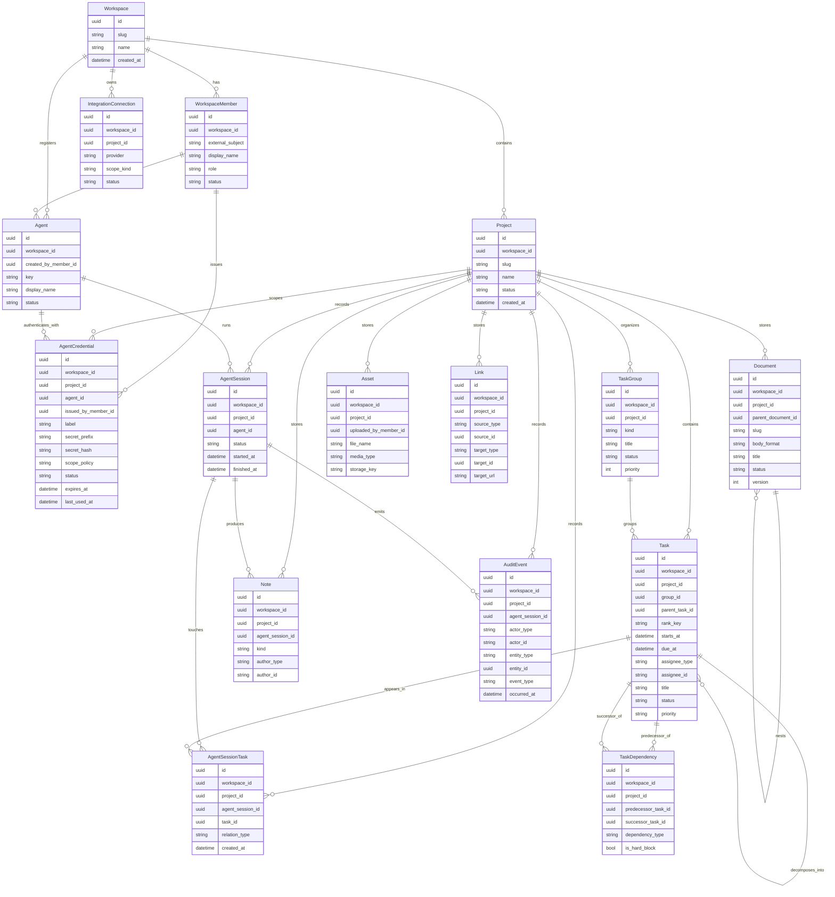

# Product Specification: agent-workspace

## 1. Назначение

`agent-workspace` — система для совместной работы людей и агентных инструментов над задачами, группами задач, документацией и заметками в едином контексте.

Ключевая идея: агент не должен быть внешним потребителем разрозненных данных. Он должен работать внутри общего контекста, где задачи, документы, заметки, ссылки на код и артефакты GitHub связаны между собой и доступны по контролируемому интерфейсу.

## 2. Проблема

Сейчас знания по проектам обычно рассыпаны по нескольким системам:

- задачи и статусы живут отдельно;
- документы и заметки живут отдельно;
- переписка агентов и результаты их работы теряются или недоступны команде;
- связка между рабочим контекстом, GitHub и агентными инструментами чаще всего не формализована.

В результате:

- агентам не хватает устойчивого и структурированного контекста;
- людям трудно понять, почему агент сделал то или иное действие;
- группы задач, заметки и документы не образуют проверяемую, прослеживаемую модель проекта.

## 3. Цели продукта

- Дать единое рабочее пространство для задач, групп задач, документов и заметок.
- Сделать агентные действия наблюдаемыми и аудируемыми.
- Обеспечить удобный доступ к проектному контексту и людям, и агентам.
- Свести инфраструктурный оверхед к минимуму на первом этапе.
- Сохранить путь к масштабированию без преждевременного усложнения архитектуры.

## 4. Не-цели первой версии

- Полноценный микросервисный ландшафт на старте.
- Отдельное специализированное векторное хранилище.
- Сложный workflow engine для многошаговых автоматизаций.
- Полная замена GitHub Issues, Jira, Notion и других систем на первом релизе.

## 5. Пользовательские роли

### 5.1 Человек-исполнитель

Использует систему для просмотра задач, ведения заметок, чтения документов, фиксации структуры работ и контроля изменений.

### 5.2 Лид или координатор

Планирует работы, видит общую картину, контролирует ход выполнения, связывает инициативы с внешними интеграциями.

### 5.3 Агент

Через MCP-обертку получает ограниченный, трассируемый доступ к задачам, заметкам, документам и операциям обновления.

### 5.4 Интеграционный контур

GitHub и другие внешние системы синхронизируют артефакты и события с `agent-workspace`.

## 6. Основные сценарии

### 6.1 Работа с задачами

- создание и декомпозиция задач;
- связывание задач с группами задач, страницами документации, файлами и заметками;
- ведение статуса и журнала изменений;
- назначение задач людям и агентам.

### 6.2 Работа с группами задач и зависимостями

- объединение задач в инициативы, эпики или иные логические группы;
- декомпозиция крупных работ на дочерние задачи;
- явная фиксация зависимостей между задачами;
- определение блокирующих и заблокированных задач на основе графа зависимостей;
- приоритизация задач внутри проекта и группы.

### 6.3 Работа с базой знаний, файлами и заметками

- хранение долговременной проектной документации как markdown-страниц;
- иерархия страниц, внутренние ссылки, версионирование и поиск по содержимому;
- встраивание изображений, схем, ссылок на файлы и внешние артефакты;
- хранение файловых артефактов и вложений отдельно от самих страниц документации;
- быстрые заметки по ходу работы.

### 6.4 Работа агентов

- чтение контекста по проекту;
- поиск релевантных задач, групп задач, страниц документации и заметок;
- создание заметок и обновление связанных задач;
- запись следов своей активности и результатов.

### 6.5 Интеграция с GitHub

- связывание задач с issue, pull request, commit и branch;
- импорт или синхронизация статусов;
- использование GitHub-артефактов как части общего проектного контекста.

## 7. Функциональные требования MVP

### 7.1 Рабочие пространства и проекты

- система должна поддерживать несколько рабочих пространств;
- внутри рабочего пространства должны существовать проекты;
- `Project` всегда принадлежит `Workspace`;
- все проектные сущности должны быть привязаны и к `Workspace`, и к `Project`;
- сущности уровня `Workspace` допустимы только там, где они используются сразу в нескольких проектах.

### 7.2 Базовые сущности

В MVP должны существовать как минимум следующие сущности:

- `Workspace`
- `WorkspaceMember`
- `Project`
- `Task`
- `TaskGroup`
- `TaskDependency`
- `Document`
- `Asset`
- `Note`
- `Link`
- `Agent`
- `AgentCredential`
- `AgentSession`
- `AgentSessionTask`
- `IntegrationConnection`
- `AuditEvent`

### 7.3 Поиск и навигация

- точный полнотекстовый поиск по задачам, страницам документации и заметкам;
- поиск файловых assets по имени, типу и связанным сущностям;
- фильтрация по типам сущностей, проектам, тегам и статусам;
- выдача должна объяснять, почему объект найден.
- семантический поиск, embeddings и `pgvector` не входят в ближайший MVP-объем; к ним можно вернуться после стабилизации core-domain, схемы БД и API-контракта.

### 7.4 MCP-интерфейс

MCP-утилита должна поддерживать как минимум следующие сценарии:

- поиск задач;
- просмотр группы задач и ее состава;
- получение страницы документации или заметки по идентификатору;
- добавление заметки;
- ограниченное обновление статуса задачи;
- просмотр блокировок и зависимостей по задаче;
- получение последних связанных изменений по проекту.

### 7.5 Аудит и прослеживаемость

- каждое изменение должно иметь автора;
- автором может быть человек, агент или интеграция;
- важные операции должны сохраняться в `AuditEvent`;
- связь между `AgentSession` и затронутыми `Task` должна сохраняться отдельно для трассировки работы агента;
- в MVP не хранится сырой пошаговый журнал работы агента; достаточно агрегированных `AuditEvent`, связей через `AgentSessionTask` и итоговых заметок или результатов;
- для страниц документации, заметок и описаний групп задач желательно предусмотреть версионирование уже в первом архитектурном слое.

### 7.6 Доступ, админка и ключи агентов

- для человеческих пользователей в MVP не следует строить собственную парольную систему; аутентификация должна идти через внешний identity provider по OIDC либо OAuth 2.0 через стороннего провайдера;
- `WorkspaceMember.external_subject` должен хранить стабильный идентификатор субъекта из внешнего провайдера аутентификации;
- web-интерфейс должен работать через серверную сессию или короткоживущую защищенную cookie c флагами `HttpOnly`, `Secure` и `SameSite`;
- все изменяющие web-операции в cookie-based контуре должны быть защищены от CSRF;
- человеческие сессии должны поддерживать ограниченный срок жизни, logout и принудительное завершение при отключении участника или изменении критичных прав доступа;
- для локальной разработки должен существовать отдельный `dev-auth` режим без внешних provider credentials; он может поднимать преднастроенных `WorkspaceMember` и dev-агента, но должен быть доступен только в development-профиле;
- админка должна позволять управлять участниками workspace, ролями, агентами, ключами агентов, интеграциями и просмотром аудита;
- система должна поддерживать безопасный bootstrap первого `owner`, приглашение новых `WorkspaceMember`, отключение участника и при необходимости передачу владения workspace;
- агентные ключи должны выпускаться как отдельные credentials, быть привязаны к конкретному `Agent`, иметь создателя, статус, срок действия, scope-набор и возможность отзыва;
- секрет ключа агента должен показываться только в момент создания и далее храниться на сервере только в виде криптографического hash;
- доступ агента должен определяться пересечением статуса `Agent`, статуса `AgentCredential`, scope-набора ключа и границ `Workspace` или `Project`;
- в MVP агент аутентифицируется прямым `AgentCredential` без отдельного exchange-механизма в короткоживущий access token;
- human/web-доступ и agent/MCP-доступ должны рассматриваться как разные security-контуры: сессионная cookie человека не должна использоваться как агентный credential, а агентный ключ не должен давать доступ к human-admin функциям;
- операции создания, ротации, отзыва и использования ключей должны попадать в `AuditEvent`;
- для чувствительных секретов интеграций должно использоваться шифрование at rest;
- все auth- и credential-endpoints должны быть защищены rate limiting и базовой защитой от brute force.

### 7.7 Организация админки MVP

- админка не должна быть отдельным приложением на старте; ее следует реализовать как защищенный раздел основного web-интерфейса;
- основная граница админки в MVP — `Workspace`, а не `Project`;
- в MVP полный доступ к админке должен быть только у роли `owner`; роли `editor` и `viewer` не должны иметь доступа к управлению участниками, агентами, credentials, интеграциями и security-настройками;
- если позже одного `owner`-контура окажется недостаточно, лучше добавить отдельную роль оператора или администратора, чем перегружать `editor` security-функциями;
- структура админки должна быть секционной и предсказуемой, без отдельного сложного control plane.

Рекомендуемые разделы админки MVP:

- `Overview`: сводка по участникам, агентам, активным credentials, интеграциям и последним security-событиям;
- `Members`: приглашение, изменение роли, отключение участника, передача владения;
- `Agents`: создание и отключение агентных учеток, просмотр последней активности и связанных sessions;
- `Agent Credentials`: выпуск, ротация, отзыв и просмотр metadata ключей;
- `Integrations`: подключение, отключение и проверка состояния GitHub и других внешних интеграций;
- `Audit`: просмотр значимых административных и security-событий с фильтрацией.

UX-принципы для админки:

- credentials и иные секреты показываются только в момент создания;
- после создания в UI отображаются только безопасные metadata: label, prefix, scopes, created by, created at, expires at, last used at, status;
- отзыв credential должен быть отдельной операцией от удаления;
- ротация должна создавать новый credential до отключения старого;
- критичные операции должны требовать явного подтверждения;
- система не должна позволять удалить или отключить последнего активного `owner`;
- операции изменения ролей, credentials и интеграций должны быть сразу видны в `Audit`.

### 7.8 Глобальное управление системой

- необходимо различать два разных контура управления: `workspace admin` и `system operator`;
- `workspace admin` относится к конкретному workspace и управляется владельцами этого workspace;
- `system operator` относится ко всей инсталляции `agent-workspace` и не должен зависеть от ролей внутри конкретных workspace;
- права глобального оператора не должны выдаваться владельцами workspace и не должны наследоваться из `WorkspaceMember.role`;
- agent credentials и MCP-контур не должны иметь доступа к глобальному управлению системой;
- в MVP глобальный операторский контур не обязан быть отдельным приложением, но должен быть отдельным логическим модулем, отдельным route namespace и отдельной политикой авторизации;
- для self-hosted и локальных инсталляций допустимо начать без полноценной глобальной UI-админки, ограничившись bootstrap-механизмом, конфигурацией и минимальными internal-only endpoint-ами или CLI-командами;
- для hosted-модели и multi-workspace инсталляций нужен внутренний операторский интерфейс для управления всей платформой;
- доступ в глобальный операторский контур в MVP задается через system-level allowlist аутентифицированных external subjects; отдельная постоянная модель `PlatformOperator` на первом этапе не требуется;
- выносить глобальный операторский контур в отдельное приложение стоит позже, когда появятся отдельная ops/support-команда, выраженная multi-tenant hosted-модель, billing/compliance-требования или необходимость более жесткой сетевой изоляции.

Минимальные функции глобального операторского контура:

- просмотр списка workspace и их состояния;
- временная блокировка или отключение workspace;
- просмотр глобального security и operational audit;
- управление system-level allowlist операторов;
- просмотр состояния интеграций, фоновых задач и критичных системных компонентов;
- аварийные операции уровня инсталляции, которые недоступны владельцам отдельных workspace.

## 8. Нефункциональные требования

- низкое потребление памяти и предсказуемая нагрузка на CPU;
- безопасность по умолчанию и строгая типизация прикладной логики;
- отсутствие локального хранения пользовательских паролей в MVP;
- невосстановимое хранение agent credentials и шифрование чувствительных секретов интеграций;
- поддержка ротации, отзыва и ограничения scope для агентных ключей;
- обязательный аудит событий входа, отказа в доступе, выпуска и отзыва ключей;
- удобный локальный запуск через Docker;
- поддержка облегченного local/dev-профиля на SQLite без обязательного запуска PostgreSQL;
- возможность запуска базовой конфигурации на одной машине;
- архитектурная возможность последующего выноса отдельных контуров в сервисы.

## 9. Технические решения первой итерации

### 9.1 Бэкенд

- язык: Rust;
- HTTP API: `axum`;
- асинхронный runtime: `tokio`;
- логирование и трассировка: `tracing`;
- доступ к БД: `sqlx`;
- прикладная логика не должна зависеть от конкретной СУБД напрямую; слой хранения должен быть оформлен через persistence/repository-абстракции;
- первая реализация persistence-слоя должна поддерживать `postgres` как основной backend и `sqlite` как облегченный local/dev backend.

Первичный HTTP-контракт фиксируется отдельно в [api-contract.md](./api-contract.md).

### 9.2 Фронтенд

- React + TypeScript;
- стартовая сборка через Vite;
- фронтенд работает как тонкий UI над API и поиском;
- workspace-админка реализуется как модуль внутри основного web-приложения, а не как отдельный frontend;
- глобальный операторский контур на старте может жить в том же frontend-кодбейзе, но должен быть отделен по route namespace, layout и policy checks; отдельным приложением его стоит делать позже, если это оправдает операционная модель.

Общая структура UI и информационная архитектура зафиксированы отдельно в [ui-structure.md](./ui-structure.md).

### 9.3 Хранилище данных

Основной СУБД первой рабочей версии остается PostgreSQL.

Одновременно проекту нужен упрощенный local/dev профиль на SQLite, чтобы снизить порог локального запуска, тестов и одиночных сценариев без Docker Compose.

Причины:

- зрелая транзакционная модель;
- хорошие средства полнотекстового поиска;
- простое локальное и контейнерное развертывание;
- отсутствие необходимости тащить отдельный стек хранения на первой версии.

Практическое решение первой итерации:

- production, shared-dev и self-hosted профили ориентируются на PostgreSQL как на каноничный backend;
- local/dev и облегченные тестовые сценарии могут использовать SQLite через тот же persistence-слой;
- схема доменных таблиц первой итерации не должна зависеть от `pgvector` или других PostgreSQL-only extension-ов;
- если позже появятся Postgres-only возможности, они должны явно маркироваться как недоступные в SQLite-профиле, а не маскироваться неявными fallback-ами.

Текстовая схема данных первой итерации фиксируется отдельно в [database-schema.md](./database-schema.md).

### 9.4 Поиск первой итерации

В ближайшем приоритете нужен только полнотекстовый поиск.

Рекомендуемый подход:

- production-профиль должен давать предсказуемый полнотекстовый поиск по задачам, документам и заметкам;
- SQLite local/dev профиль может использовать упрощенный поисковый режим и не обязан обеспечивать полную parity по релевантности с PostgreSQL;
- embeddings, semantic ranking и `pgvector` выводятся за пределы ближайшей технической итерации;
- возврат к семантическому поиску допустим только после стабилизации базовой доменной модели, схемы БД и API-контракта.

Что покрывать поиском в первой очереди:

- документы;
- имена и metadata файловых assets;
- заметки;
- описания задач;
- связанные артефакты GitHub, доступные как mirror-контекст.

### 9.5 Интеграция с GitHub

Интеграция с GitHub имеет прямой практический смысл уже в ранних версиях.

Приоритетные сценарии:

- привязка `Task` к `Issue` и `Pull Request`;
- импорт состояния pull request в карточку задачи;
- хранение ссылок на commit и branch;
- обогащение контекста для агентов при выполнении инженерных задач.

На старте интеграцию стоит делать как модуль внутри основного API, а не как отдельный сервис.

В MVP GitHub остается внешней интеграцией и зеркалом инженерных артефактов, но не становится источником истины для внутренних `Task` и `TaskGroup`.

### 9.6 Стратегия человеческой аутентификации

Для первой рабочей поставки GitHub OAuth подтвержден как стартовый provider, но протокольная и доменная модель должны оставаться provider-agnostic.

Рекомендуемый подход:

- прикладную модель и поля идентичности строить provider-agnostic, чтобы `WorkspaceMember.external_subject` не зависел от одного вендора;
- для первой внешней версии использовать GitHub OAuth как самый быстрый путь для инженерной аудитории;
- не завязывать доменную модель на GitHub-специфику: внутренне идентификатор субъекта должен храниться в формате, допускающем переход на полноценный OIDC без миграции предметной модели;
- при росте требований к SSO, корпоративным политикам и мульти-провайдерной аутентификации перейти на полноценный OIDC-провайдер без изменения бизнес-сущностей.

Практический смысл такого решения:

- GitHub OAuth проще запустить на MVP, потому что не требует отдельного auth-сервиса и хорошо совпадает с целевой инженерной аудиторией;
- OIDC архитектурно чище и лучше для долгой жизни продукта, но обычно требует либо отдельного провайдера, либо внешнего managed-сервиса;
- поэтому GitHub OAuth стоит считать стартовым provider-вариантом, а OIDC — целевым эволюционным направлением, если продукт выйдет за пределы чисто инженерного контура.

### 9.7 Локальный режим аутентификации

Для локальной разработки и демо-стендов нужен отдельный dev-only режим, не требующий внешних credentials.

Требования к нему:

- режим должен включаться только явной конфигурацией, например отдельным профилем окружения или Docker Compose profile;
- в этом режиме система может поднимать преднастроенных `WorkspaceMember` с ролями `owner`, `editor` и `viewer`, а также тестового `Agent`;
- dev-only режим не должен быть доступен в production-сборках и production-конфигурациях;
- если используется bypass для агентного доступа без ручного ввода ключей, он должен работать только в локальном контуре `localhost` или внутренней Docker-сети разработки;
- UI и API в dev-only режиме должны явно маркироваться как небезопасные для production;
- локальный режим нужен только для удобства разработки и тестирования сценариев, а не как упрощенный production-path.

### 9.8 Хранение файловых assets

Файловые assets должны храниться через отдельную storage-абстракцию, а не внутри PostgreSQL.

Рекомендуемый подход:

- metadata и связи asset-объектов хранятся в PostgreSQL;
- бинарное содержимое хранится во внешнем storage backend;
- API работает с backend-ом через единый интерфейс `AssetStorage`;
- в development и простом self-hosted режиме должен поддерживаться `local` backend;
- в production и hosted-развертываниях должен использоваться `s3-compatible` backend;
- доступ к файлам по умолчанию должен быть приватным и контролироваться через API policy checks;
- выдача файла может идти через proxy-download или через short-lived signed URLs.

Решение подробно зафиксировано в [ADR-0002](../adr/0002-asset-storage.md).

### 9.9 Архитектурные представления

Для архитектурной документации проекта сохраняется подход C4 как reference-модель, но выпуск диаграмм не является ближайшим приоритетом.

В ближайшей очереди нужно фиксировать текстовые артефакты, которые напрямую ведут к реализации:

- схема БД;
- API-контракт;
- access model и persistence adapter contract.

К диаграммам имеет смысл возвращаться только после стабилизации этих артефактов и первого слоя миграций и endpoint-ов.

Подход и план представлений зафиксированы отдельно в [architecture-views.md](./architecture-views.md).

## 10. Архитектурная стратегия

### 10.1 Почему не микросервисы на старте

Полный микросервисный подход сейчас преждевременно усложнит систему:

- больше инфраструктуры;
- сложнее локальная разработка;
- выше стоимость трассировки и диагностики;
- нужна стабильная доменная модель, которой пока еще нет.

### 10.2 Рекомендуемый подход

Первая версия должна быть модульным монолитом с явными bounded contexts:

- `workspace-core`
- `task-management`
- `task-structure`
- `knowledge-base`
- `agent-sessions`
- `search-indexing`
- `github-integration`
- `mcp-access`

Это даст:

- простую поставку и развертывание;
- низкий инфраструктурный оверхед;
- понятные границы для последующего выделения сервисов, если это реально понадобится.

## 11. Предварительная модель данных

| Сущность | Назначение |
| --- | --- |
| Workspace | Граница организации и набора проектов |
| WorkspaceMember | Человек-участник рабочего пространства с ролью и идентичностью внутри workspace |
| Project | Контекст конкретной инициативы или продукта |
| TaskGroup | Группа задач уровня инициативы, эпика или иного крупного блока работ |
| Task | Рабочая единица с ответственным, статусом, приоритетом и опциональной принадлежностью к одной группе |
| TaskDependency | Направленная зависимость между задачами, на основе которой вычисляются блокировки |
| Document | Версионируемая markdown-страница базы знаний проекта |
| Asset | Загружаемый файл или изображение, на которое можно ссылаться из документации, заметок и других сущностей |
| Note | Быстрая заметка, наблюдение, вывод или промежуточный результат |
| Link | Унифицированная связь между сущностями и внешними ресурсами |
| Agent | Агентный идентификатор и его профиль доступа |
| AgentCredential | Выпущенный ключ или credential агента с ограничением по scope и lifecycle-полями |
| AgentSession | Сессия работы агента с журналом действий |
| AgentSessionTask | Связь между агентной сессией и задачей, затронутой в ходе работы |
| IntegrationConnection | Настройки внешней интеграции |
| AuditEvent | Запись о значимом изменении в системе |

### 11.1 Концептуальная ER-модель

### 11.2 Правила моделирования

- `Workspace` является корневой сущностью, а `Project` — основной прикладной границей внутри рабочего пространства.
- Для MVP `Workspace` достаточен как логическая tenant-граница; отдельная platform-tenant модель на первом этапе не требуется.
- `WorkspaceMember` является минимальной человеческой сущностью в MVP: это участник рабочего пространства, а не технический агент.
- Человеческая аутентификация в MVP должна опираться на внешний identity provider; система не должна хранить локальные пароли пользователей.
- `TaskGroup` хранит верхнеуровневую организацию работ: инициатива, эпик или иной крупный кластер задач структурного уровня.
- `Task.group_id` остается опциональным: задача может существовать вне группы, но не может принадлежать более чем одной группе одновременно.
- `Task.parent_task_id` нужен для декомпозиции крупных задач на подзадачи без отдельной сущности шага плана.
- Каноническая модель задач должна оставаться view-agnostic: list, board, timeline, calendar, hierarchy и dependency-view должны быть разными представлениями одних и тех же данных, а не разными типами задач.
- Для поддержки популярных способов организации задач `Task` должен нести не только статус и иерархию, но и поля упорядочивания и времени, например `rank_key`, `starts_at` и `due_at`.
- Ответственный по задаче хранится отдельно через `Task.assignee_type` и `Task.assignee_id`; в MVP задача может быть назначена `WorkspaceMember` или `Agent` без смешения этих сущностей.
- `TaskDependency` хранит граф зависимостей. Состояния "blocked" и "blocking" вычисляются из него, а не сохраняются как основной источник истины в самой задаче.
- `dependency_type` в MVP можно ограничить значением `blocks`, но поле стоит оставить расширяемым на будущее.
- `Document` является страницей базы знаний с markdown-содержимым, а не произвольным бинарным файлом.
- `Document.parent_document_id` позволяет строить древовидную структуру документации внутри проекта.
- `Document` должен поддерживать markdown-вёрстку, изображения, схемы, внутренние ссылки и ссылки на файлы.
- `Asset` хранит файловые артефакты и вложения отдельно от `Document`; изображения и другие файлы в документации должны ссылаться именно на `Asset`.
- `Document`, `Asset` и `Note` связываются с задачами, группами задач и внешними объектами через `Link`, чтобы не раздувать количество прямых nullable-ссылок.
- `Link` задает унифицированную полиморфную связь между сущностями системы и внешними ресурсами, включая GitHub issue, pull request, commit и branch.
- GitHub-интеграция в MVP обогащает контекст и синхронизирует внешние артефакты, но не подменяет внутренние `Task` и `TaskGroup` как источник истины.
- `Agent` моделируется как workspace-scoped сущность, а конкретная работа агента по проекту фиксируется в `AgentSession`.
- `Agent.created_by_member_id` хранит, какой `WorkspaceMember` зарегистрировал или добавил агентную учетку в систему.
- `AgentCredential` является отдельной сущностью доступа. Один агент может иметь несколько credentials для разных контуров использования, ротации и отзыва.
- Секрет `AgentCredential` должен храниться только в виде hash; поле `secret_prefix` используется для безопасного отображения и поиска ключа без раскрытия полного секрета.
- `AgentCredential.project_id` является опциональным и позволяет ограничить ключ одним проектом; при `NULL` credential действует в пределах всего workspace, но только в рамках назначенных scopes.
- `scope_policy` должен интерпретироваться по принципу deny by default: ключ получает только явно выданные разрешения.
- Человек и `Agent` не являются одной и той же сущностью. В MVP человеческий субъект моделируется через `WorkspaceMember`, а в журналах и назначениях различается через поля вида `actor_type` / `actor_id` и `assignee_type` / `assignee_id`.
- Связь между `Task` и `AgentSession` должна моделироваться не прямым foreign key в задаче, а через отдельную сущность `AgentSessionTask`, поскольку одна сессия может затрагивать много задач, а одна задача может фигурировать во многих сессиях.
- `AgentSessionTask` является сущностью трассировки, а не владения: она показывает, что агентная сессия работала с задачей, но не заменяет назначение, ответственность или жизненный цикл задачи.
- В MVP не хранится сырой пошаговый журнал работы агента; трассировка строится через `AgentSession`, `AgentSessionTask`, `AuditEvent` и связанные `Note`.
- `IntegrationConnection` по умолчанию создается на уровне `Workspace`, но может быть ограничен конкретным `Project`, если интеграция нужна не для всех проектов.
- `AuditEvent` использует универсальные поля `actor_type` и `actor_id`, чтобы одинаково фиксировать действия `WorkspaceMember`, `Agent` или интеграции.
- В `AuditEvent` должны попадать не только бизнес-изменения, но и security-события: вход, неуспешная аутентификация, создание credential, отзыв credential и отказ в доступе.
- Локальные планы IDE-агентов и CLI-агентов в MVP не сохраняются как отдельные сущности. Если такая потребность появится позже, их лучше моделировать как артефакты `AgentSession`, а не как параллельную систему `Plan`/`PlanStep`.

### 11.3 Ключевые кардинальности

- Один `Workspace` содержит много `WorkspaceMember`, `Project`, `Agent` и `IntegrationConnection`.
- Один `Project` содержит много `TaskGroup`, `Task`, `Document`, `Asset`, `Note`, `Link`, `AgentSession`, `AgentSessionTask` и `AuditEvent`.
- Один `WorkspaceMember` может создать много `Agent`.
- Один `WorkspaceMember` может выпустить много `AgentCredential`.
- Один `TaskGroup` содержит много `Task`, но каждая `Task` принадлежит не более чем одной группе.
- Одна `Task` может иметь много дочерних `Task` через `parent_task_id`.
- Одна `Task` может иметь много входящих и исходящих `TaskDependency`.
- Один `Document` может иметь много дочерних `Document` через `parent_document_id`.
- Один `Agent` может иметь много `AgentSession`.
- Один `Agent` может иметь много `AgentCredential`.
- Одна `AgentSession` может порождать много `Note` и `AuditEvent`.
- Одна `AgentSession` может быть связана со многими `Task` через `AgentSessionTask`.
- Одна `Task` может фигурировать во многих `AgentSession` через `AgentSessionTask`.

### 11.4 Словари значений MVP

Ниже зафиксированы контролируемые значения для первой версии. Это не исключает расширения словарей позже, но на уровне MVP лучше держать их закрытыми и предсказуемыми.

`WorkspaceMember.role`

| Значение | Смысл |
| --- | --- |
| `owner` | Полный контроль над workspace, участниками, агентами и интеграциями |
| `editor` | Рабочий доступ к проектным сущностям и операциям изменения |
| `viewer` | Доступ только на чтение |

Примечание: в MVP только `owner` имеет доступ к административному контуру workspace.

`WorkspaceMember.status`

| Значение | Смысл |
| --- | --- |
| `active` | Участник активен и может работать в системе |
| `invited` | Участник приглашен, но еще не завершил вход или активацию |
| `disabled` | Участник временно отключен от работы в workspace |

`Project.status`

| Значение | Смысл |
| --- | --- |
| `active` | Проект находится в активной работе |
| `on_hold` | Проект временно приостановлен |
| `archived` | Проект архивирован и не участвует в текущей работе |

`TaskGroup.kind`

| Значение | Смысл |
| --- | --- |
| `initiative` | Крупная инициатива или направление работ |
| `epic` | Группа задач уровня эпика |

Примечание: `release` пока не моделируется как `TaskGroup.kind`, поскольку релиз является отдельной осью планирования и поставки, а не структурной группой задач.

`TaskGroup.status`

| Значение | Смысл |
| --- | --- |
| `draft` | Группа только формируется |
| `active` | Группа находится в работе |
| `done` | Работа по группе завершена |
| `archived` | Группа переведена в архив |

`Task.status`

| Значение | Смысл |
| --- | --- |
| `todo` | Задача готова к началу или находится в очереди |
| `in_progress` | Задача находится в активной работе |
| `done` | Задача завершена |
| `cancelled` | Задача отменена |

Примечание: состояние `blocked` не входит в словарь `Task.status` и вычисляется из `TaskDependency`.

`Task.priority`

| Значение | Смысл |
| --- | --- |
| `low` | Низкий приоритет |
| `normal` | Нормальный рабочий приоритет |
| `high` | Высокий приоритет |
| `critical` | Критический приоритет |

Примечание: `TaskGroup.priority` пока остается числовым полем сортировки, а не enum-словарем.

`Task.assignee_type`

| Значение | Смысл |
| --- | --- |
| `workspace_member` | Задача назначена человеку внутри workspace |
| `agent` | Задача назначена агентной учетке |

Примечание: отсутствие назначения выражается `NULL` в `assignee_type` и `assignee_id`.

`TaskDependency.dependency_type`

| Значение | Смысл |
| --- | --- |
| `blocks` | Предшествующая задача блокирует начало или завершение последующей |

`Document.status`

| Значение | Смысл |
| --- | --- |
| `draft` | Документ находится в работе |
| `published` | Документ считается актуальным и опубликованным |
| `archived` | Документ выведен из активного использования |

`Document.body_format`

| Значение | Смысл |
| --- | --- |
| `markdown` | Основной формат базы знаний в MVP |

`Note.kind`

| Значение | Смысл |
| --- | --- |
| `context` | Контекстная заметка или справочная фиксация |
| `worklog` | Рабочая заметка по ходу выполнения |
| `decision` | Зафиксированное решение |
| `result` | Итог выполнения или вывод |

`Note.author_type` и `AuditEvent.actor_type`

| Значение | Смысл |
| --- | --- |
| `workspace_member` | Действие или запись выполнены человеком |
| `agent` | Действие или запись выполнены агентом |
| `integration` | Действие или запись пришли из внешней интеграции |

`Agent.status`

| Значение | Смысл |
| --- | --- |
| `active` | Агентная учетка доступна для использования |
| `disabled` | Агентная учетка отключена |

`AgentCredential.status`

| Значение | Смысл |
| --- | --- |
| `active` | Credential активен и может использоваться |
| `revoked` | Credential отозван и больше не должен приниматься |

Примечание: истечение срока действия определяется через `expires_at` и может вычисляться как операционное состояние поверх `status`.

`AgentCredential.scope_policy`

Каждый credential должен хранить набор явно выданных scopes. Для MVP достаточно поддержать следующие атомарные разрешения:

| Значение | Смысл |
| --- | --- |
| `tasks:read` | Чтение задач и их зависимостей |
| `tasks:write_status` | Ограниченное изменение статуса задач |
| `task_groups:read` | Чтение групп задач |
| `documents:read` | Чтение документов |
| `assets:read` | Чтение файлов и изображений, связанных с документацией и другими сущностями |
| `notes:read` | Чтение заметок |
| `notes:write` | Создание заметок |
| `audit:read_recent` | Чтение последних связанных изменений по проекту |

`AgentSession.status`

| Значение | Смысл |
| --- | --- |
| `running` | Сессия активна |
| `completed` | Сессия завершилась успешно |
| `failed` | Сессия завершилась с ошибкой |
| `cancelled` | Сессия была остановлена |

`AgentSessionTask.relation_type`

| Значение | Смысл |
| --- | --- |
| `primary_context` | Задача была основной целью данной сессии |
| `touched` | Задача была затронута по ходу работы |
| `created` | Задача была создана в рамках сессии |
| `updated` | Задача была обновлена в рамках сессии |

`IntegrationConnection.provider`

| Значение | Смысл |
| --- | --- |
| `github` | Интеграция с GitHub |

`IntegrationConnection.scope_kind`

| Значение | Смысл |
| --- | --- |
| `workspace` | Интеграция действует на весь workspace |
| `project` | Интеграция ограничена конкретным project |

`IntegrationConnection.status`

| Значение | Смысл |
| --- | --- |
| `active` | Интеграция активна |
| `disabled` | Интеграция отключена |
| `error` | Интеграция находится в ошибочном состоянии |

`Link.source_type`, `Link.target_type` и `AuditEvent.entity_type`

| Значение | Смысл |
| --- | --- |
| `workspace_member` | Ссылка или событие относятся к участнику workspace |
| `project` | Ссылка или событие относятся к проекту |
| `task_group` | Ссылка или событие относятся к группе задач |
| `task` | Ссылка или событие относятся к задаче |
| `document` | Ссылка или событие относятся к документу |
| `asset` | Ссылка или событие относятся к файлу или изображению |
| `note` | Ссылка или событие относятся к заметке |
| `agent` | Ссылка или событие относятся к агентной учетке |
| `agent_session` | Ссылка или событие относятся к агентной сессии |
| `integration_connection` | Ссылка или событие относятся к подключению интеграции |
| `github_issue` | Внешний GitHub issue |
| `github_pull_request` | Внешний GitHub pull request |
| `github_commit` | Внешний GitHub commit |
| `github_branch` | Внешняя GitHub branch |
| `external_url` | Произвольная внешняя ссылка |

Примечание: для `AuditEvent.entity_type` в MVP в основном ожидаются внутренние типы сущностей; внешние типы нужны в первую очередь для `Link.target_type`.

`AuditEvent.event_type`

| Значение | Смысл |
| --- | --- |
| `created` | Создание сущности |
| `updated` | Обновление сущности |
| `deleted` | Удаление сущности |
| `status_changed` | Изменение статуса |
| `linked` | Создание связи или привязки |
| `unlinked` | Удаление связи или привязки |
| `session_started` | Старт агентной сессии |
| `session_finished` | Завершение агентной сессии |
| `integration_synced` | Синхронизация из внешней интеграции |

## 12. MCP-утилита

MCP-обертка разворачивается отдельно и подключается к API `agent-workspace`.

Базовые свойства:

- отдельная Rust-утилита;
- локальный запуск в Docker;
- поддержка режимов подключения, пригодных для IDE и CLI-агентов;
- минимальный локальный state;
- контроль доступа через API-токены или сервисные credentials.

В первой реализации MCP-утилита не должна дублировать бизнес-логику API. Ее задача — безопасно и предсказуемо публиковать инструменты поверх уже существующих серверных операций.

## 13. Состав MVP

Рекомендуемый MVP:

- workspace и project;
- админка для участников, ролей, агентов и credentials;
- админка для интеграций и просмотра аудита;
- минимальный system-operator контур для hosted или multi-workspace инсталляций;
- CRUD групп задач;
- CRUD задач;
- зависимости между задачами и вычисление блокировок;
- markdown-база знаний, файловые assets и заметки;
- трассировка агентной работы по задачам;
- полнотекстовый поиск;
- аудит изменений;
- базовая GitHub-интеграция только на чтение;
- MCP-инструменты на чтение, запись заметок и ограниченное обновление статуса задач.

## 14. Этапы реализации

### Этап 1. Bootstrap

- монорепозиторий;
- Docker Compose;
- каркас API, MCP и web;
- выбор модели человеческой аутентификации и агентных credentials;
- спецификация и архитектурные решения.

### Этап 2. Domain foundation

- схема БД;
- persistence adapter для `postgres` и `sqlite` local/dev профиля;
- миграции;
- доменные сущности;
- аудит, идентификаторы и access model;
- первичный API-контракт.

### Этап 3. Task structure / Knowledge MVP

- CRUD групп задач;
- CRUD задач;
- зависимости между задачами и приоритеты;
- CRUD markdown-страниц документации, файловых assets и заметок;
- связи между сущностями.

### Этап 4. Search and integrations

- полнотекстовый поиск;
- упрощенный поисковый режим для SQLite local/dev профиля;
- GitHub sync только как read-only mirror интеграция;
- возврат к embeddings и `pgvector` только после core MVP, отдельным решением.

### Этап 5. MCP and agent workflows

- MCP-операции;
- ограничения доступа;
- логирование агентных действий;
- шаблоны рабочих сценариев для IDE и CLI.

## 15. Зафиксированные уточнения текущей ревизии

- для MVP достаточно `Workspace` как логической tenant-границы;
- owner-only admin-контур достаточен для первой версии;
- system-operator контур в MVP опирается на system-level allowlist без отдельной модели `PlatformOperator`;
- GitHub OAuth подтвержден как стартовый provider для human auth, при сохранении пути на OIDC;
- для MVP достаточно прямых `AgentCredential` без exchange-механизма в short-lived access token;
- по агентной работе хранятся только агрегированные события, а не сырой пошаговый журнал;
- embeddings, semantic search и `pgvector` не входят в ближайший приоритет;
- GitHub в MVP является интеграцией и зеркалом, а не источником истины для внутренних задач;
- для `Task` достаточно одной родительской `TaskGroup`;
- в MVP достаточно одного типа зависимости `blocks`.
